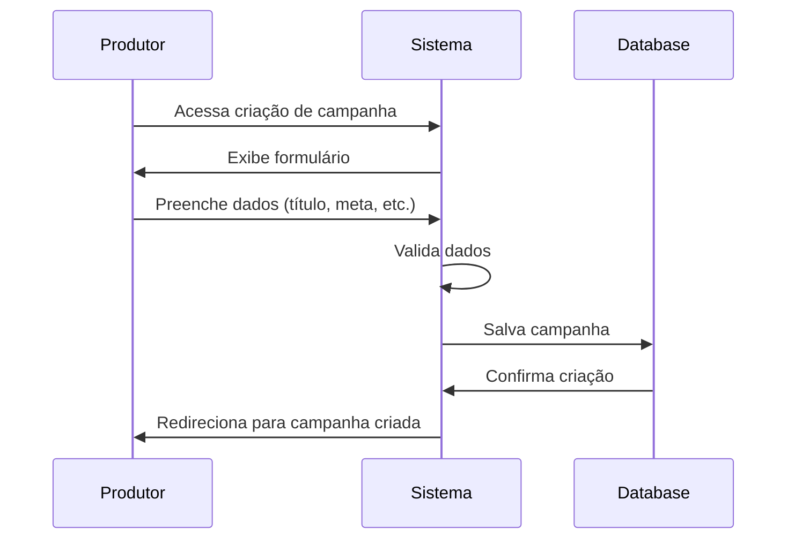
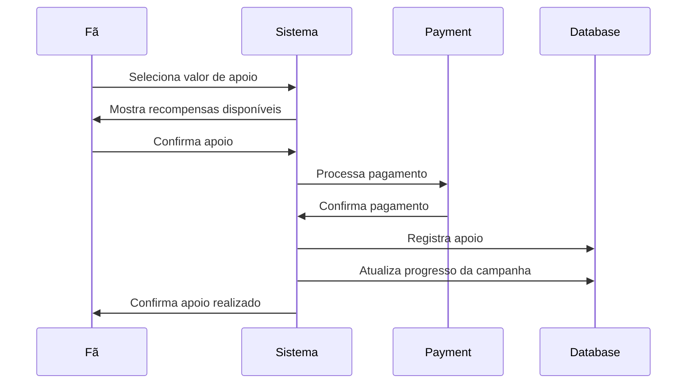
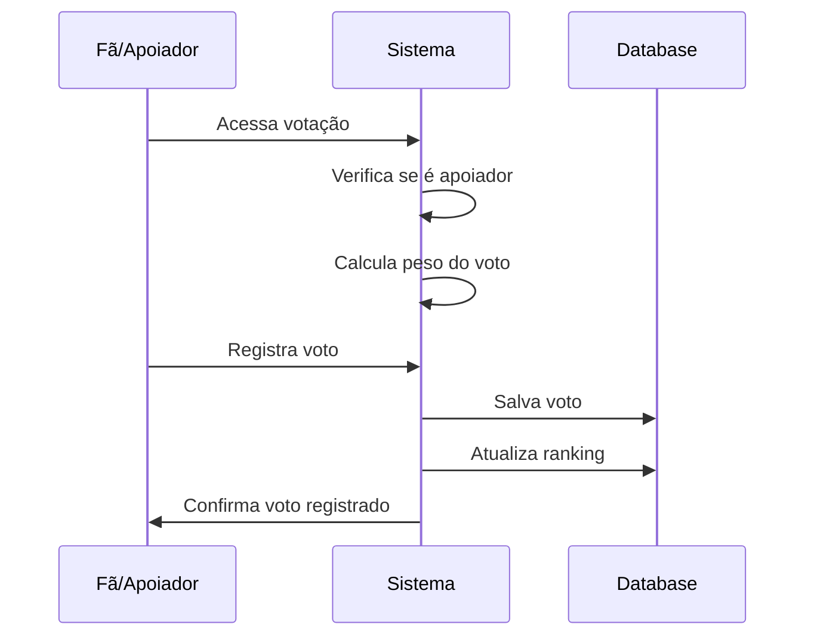

# ShowFund - Sistema de Crowdfunding Musical
## Documentação Completa do Sistema

### 1. VISÃO GERAL
ShowFund é uma plataforma de crowdfunding especializada em eventos musicais, conectando três tipos de usuários: Fãs/Apoiadores, Produtores de Eventos e Artistas/Bandas.

---

## 2. REGRAS DE NEGÓCIO

### 2.1 Tipos de Usuário
- **Fã/Apoiador**: Pode apoiar campanhas financeiramente e votar
- **Produtor de Eventos**: Pode criar campanhas para eventos musicais
- **Artista/Banda**: Pode ter perfil público e ser associado a campanhas

### 2.2 Sistema de Campanhas
- **Criação**: Apenas produtores podem criar campanhas
- **Meta Financeira**: Cada campanha deve ter uma meta de arrecadação
- **Prazo**: Campanhas têm data limite para arrecadação
- **Status**: Pode ser "ativa", "finalizada com sucesso" ou "finalizada sem sucesso"
- **Categorias**: Rock, Pop, Eletrônica, Hip-Hop, Jazz, Clássica, etc.

### 2.3 Sistema de Apoio
- **Valores Mínimos**: Apoio a partir de R$ 10,00
- **Níveis de Recompensa**: Bronze (R$ 10-49), Prata (R$ 50-199), Ouro (R$ 200+)
- **Recompensas**: Ingressos antecipados, meet & greet, merchandising

### 2.4 Sistema de Votação
- **Elegibilidade**: Apenas apoiadores podem votar
- **Peso do Voto**: Baseado no valor total apoiado pelo usuário
- **Transparência**: Resultados visíveis em tempo real

### 2.5 Rankings
- **Apoiadores**: Baseado em valor total apoiado e frequência
- **Campanhas**: Por valor arrecadado e número de apoiadores
- **Artistas**: Por engajamento e campanhas associadas

---

## 3. ESTRUTURA DE DADOS

### 3.1 Entidade User
```typescript
interface User {
  id: string;
  name: string;
  email: string;
  avatar?: string;
  type: 'fan' | 'producer' | 'artist';
  bio?: string;
  location?: string;
  socialLinks?: {
    spotify?: string;
    instagram?: string;
    youtube?: string;
  };
  stats: {
    totalSupported?: number;
    campaignsCreated?: number;
    eventsProduced?: number;
  };
}
```

### 3.2 Entidade Campaign
```typescript
interface Campaign {
  id: string;
  title: string;
  description: string;
  category: string;
  goal: number;
  raised: number;
  startDate: Date;
  endDate: Date;
  status: 'active' | 'funded' | 'failed';
  location: string;
  producerId: string;
  artistIds: string[];
  image: string;
  rewards: Reward[];
  supporters: Support[];
}
```

### 3.3 Entidade Support
```typescript
interface Support {
  id: string;
  userId: string;
  campaignId: string;
  amount: number;
  tier: 'bronze' | 'silver' | 'gold';
  timestamp: Date;
  rewardSelected?: string;
}
```

### 3.4 Entidade Vote
```typescript
interface Vote {
  id: string;
  userId: string;
  campaignId: string;
  weight: number; // baseado no valor apoiado
  timestamp: Date;
}
```

---

## 4. DIAGRAMA DE CLASSES

```mermaid
classDiagram
    class User {
        +String id
        +String name
        +String email
        +String avatar
        +UserType type
        +String bio
        +String location
        +SocialLinks socialLinks
        +UserStats stats
        +login()
        +updateProfile()
        +getSupportHistory()
    }

    class Campaign {
        +String id
        +String title
        +String description
        +String category
        +Number goal
        +Number raised
        +Date startDate
        +Date endDate
        +CampaignStatus status
        +String location
        +String producerId
        +String[] artistIds
        +String image
        +Reward[] rewards
        +Support[] supporters
        +create()
        +updateProgress()
        +checkStatus()
        +addSupport()
    }

    class Support {
        +String id
        +String userId
        +String campaignId
        +Number amount
        +SupportTier tier
        +Date timestamp
        +String rewardSelected
        +calculateTier()
        +processPayment()
    }

    class Vote {
        +String id
        +String userId
        +String campaignId
        +Number weight
        +Date timestamp
        +calculateWeight()
        +validate()
    }

    class Reward {
        +String id
        +String title
        +String description
        +Number minAmount
        +Number quantity
        +Boolean isAvailable
    }

    User ||--o{ Support : creates
    User ||--o{ Vote : casts
    User ||--o{ Campaign : produces
    Campaign ||--o{ Support : receives
    Campaign ||--o{ Vote : gets
    Campaign ||--o{ Reward : offers
    Support }o--|| Reward : selects
```

---

## 5. FLUXOS PRINCIPAIS

### 5.1 Fluxo de Criação de Campanha


### 5.2 Fluxo de Apoio à Campanha


### 5.3 Fluxo de Votação


---

## 6. REGRAS DE INTERFACE

### 6.1 Design System
- **Cores Primárias**: Verde Spotify (#1DB954) e rosa musical
- **Tipografia**: Poppins (títulos) e Work Sans (texto)
- **Tema**: Escuro por padrão com suporte a modo claro
- **Componentes**: Baseados em shadcn/ui com customizações

### 6.2 Responsividade
- **Mobile First**: Design prioritário para dispositivos móveis
- **Breakpoints**: 
  - sm: 640px
  - md: 768px
  - lg: 1024px
  - xl: 1280px

### 6.3 Navegação
- **Header Fixo**: Sempre visível no topo
- **Menu Responsivo**: Hamburger em mobile
- **Breadcrumbs**: Em páginas internas

---

## 7. ESTRUTURA DE PÁGINAS

### 7.1 Páginas Públicas
- `/` - Landing page com hero e campanhas em destaque
- `/explore` - Explorar todas as campanhas
- `/rankings` - Rankings de apoiadores e campanhas
- `/voting` - Sistema de votação
- `/campaign/:id` - Detalhes da campanha
- `/artist/:id` - Perfil público do artista

### 7.2 Páginas Autenticadas
- `/dashboard` - Dashboard do fã
- `/producer-dashboard` - Dashboard do produtor
- `/artist-dashboard` - Dashboard do artista
- `/profile` - Perfil do usuário
- `/settings` - Configurações
- `/create-campaign` - Criar nova campanha
- `/fan-profile/:id` - Perfil detalhado do apoiador

---

## 8. INTEGRAÇÕES

### 8.1 Supabase (Backend)
- **Autenticação**: Gerenciamento de usuários
- **Database**: PostgreSQL para dados estruturados
- **Storage**: Imagens de campanhas e perfis
- **Real-time**: Atualizações em tempo real

### 8.2 APIs Externas (Futuras)
- **Pagamentos**: Stripe/PagSeguro
- **Música**: Spotify API
- **Mapas**: Google Maps para localização
- **Email**: SendGrid para notificações

---

## 9. MÉTRICAS E ANALYTICS

### 9.1 KPIs Principais
- Taxa de conversão de visitantes para apoiadores
- Valor médio de apoio por usuário
- Taxa de sucesso das campanhas
- Tempo médio de permanência na plataforma

### 9.2 Dados Coletados
- Interações com campanhas
- Padrões de navegação
- Preferências musicais
- Histórico de apoios

---

## 10. ROADMAP TÉCNICO

### 10.1 Fase 1 (Atual)
- ✅ Estrutura básica da aplicação
- ✅ Sistema de autenticação simulado
- ✅ CRUD de campanhas
- ✅ Interface responsiva

### 10.2 Fase 2 (Próxima)
- 🔄 Integração com Supabase real
- 🔄 Sistema de pagamentos
- 🔄 Upload de imagens
- 🔄 Notificações em tempo real

### 10.3 Fase 3 (Futura)
- ⏳ App mobile (React Native)
- ⏳ Integração com Spotify
- ⏳ Sistema de mensagens
- ⏳ Analytics avançados

---

## 11. CONSIDERAÇÕES DE SEGURANÇA

### 11.1 Autenticação
- JWT tokens com expiração
- Refresh tokens para sessões longas
- 2FA opcional para produtores

### 11.2 Autorização
- Role-based access control (RBAC)
- Validação de permissions em todas as rotas
- Rate limiting para APIs

### 11.3 Dados Sensíveis
- Criptografia para dados financeiros
- LGPD compliance
- Logs de auditoria

---

## 12. TESTES

### 12.1 Testes Unitários
- Componentes React
- Funções utilitárias
- Hooks customizados

### 12.2 Testes de Integração
- Fluxos completos de usuário
- APIs e banco de dados
- Autenticação e autorização

### 12.3 Testes E2E
- Criação de campanha
- Processo de apoio
- Sistema de votação